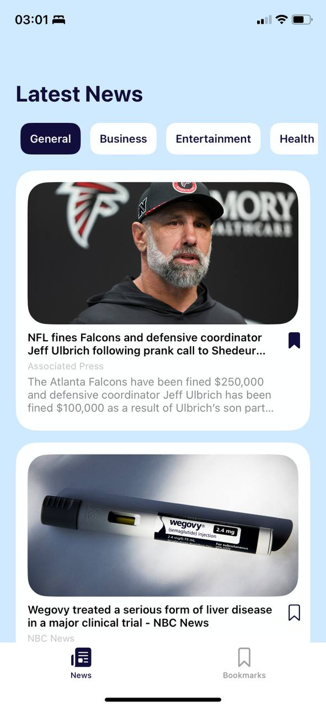
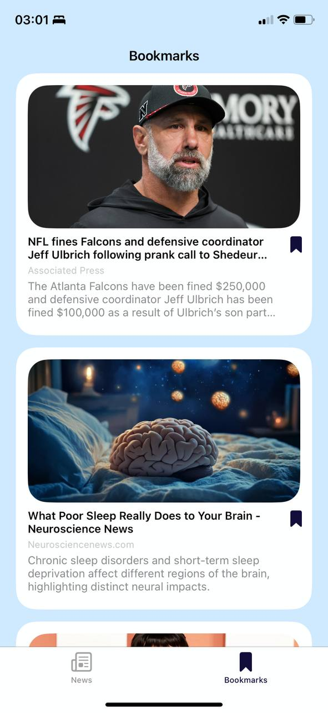
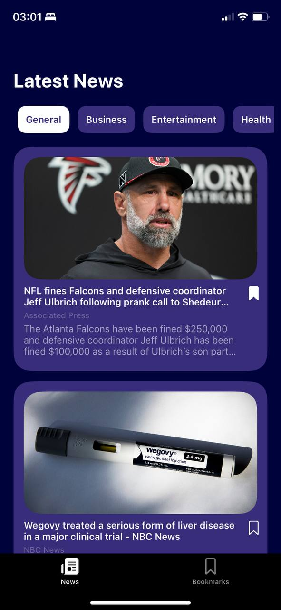
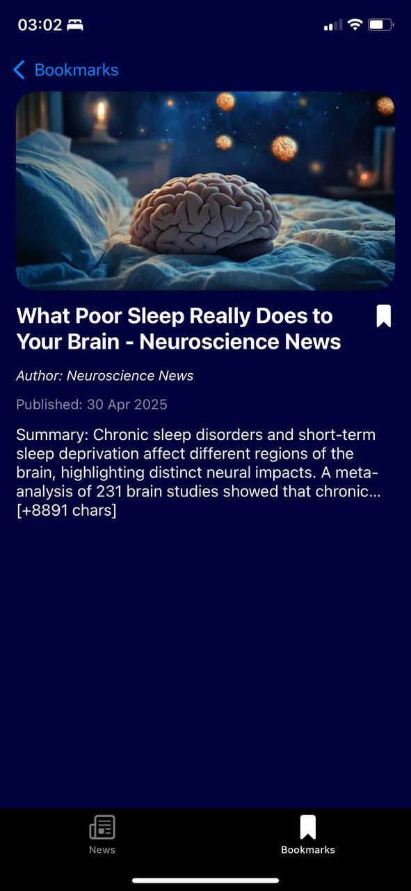
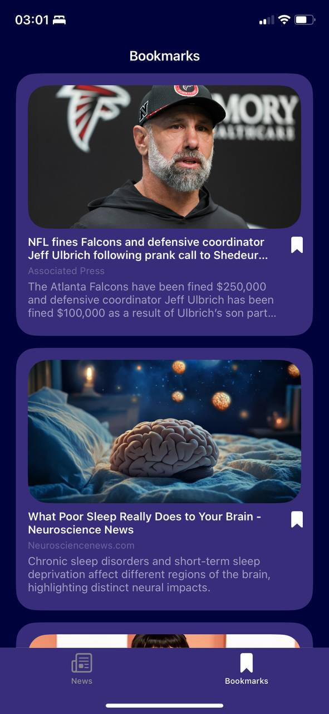
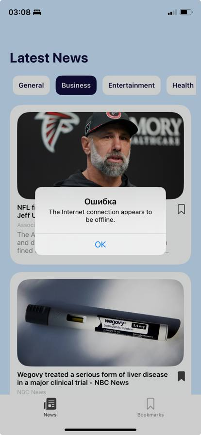
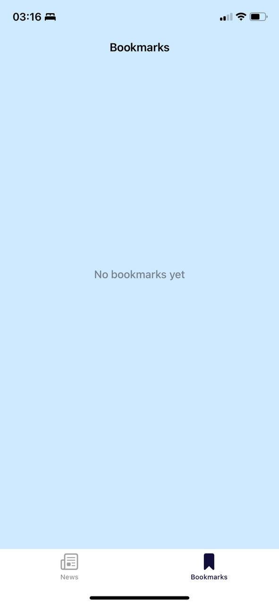

# 📰 NewsReaderApp

NewsReaderApp — это iOS-приложение для чтения новостей с использованием [NewsAPI.org](https://newsapi.org). Поддерживает категории новостей, экран подробностей, закладки и темную тему.

---

## 📱 Скриншоты

| Главный экран | Детали новости | Закладки |
|---------------|----------------|----------|
|  |  |  |

| Тёмная тема — Главная | Тёмная тема — Детали | Тёмная тема — Закладки |
|------------------------|------------------------|--------------------------|
|  |  |  |

| Ошибка сети | Пустое состояние |
|-------------|------------------|
|  |  |

---

## 🛠 Используемые технологии

- **Swift**
- **UIKit**
- **Clean Architecture**
- **MVVM**
- **CoreData** – для хранения закладок
- **NewsAPI** – источник данных
- **Programmatic UI** – без storyboard
- **Dark Mode** – с кастомными цветами

---

## 🧱 Архитектура

Приложение построено по принципам **Clean Architecture** с чётким разделением на слои:

- **Presentation Layer**
  - UIKit: экраны, коллекции, кнопки
  - ViewModels: связывают UI с UseCase, не содержат UI-кода
  - Навигация через UINavigationController и UITabBarController

- **Domain Layer**
  - UseCases: бизнес-логика (например, загрузка новостей, управление закладками)
  - Entities: модели (например, `News`)
  - Protocols: интерфейсы репозиториев (`NewsRepository`, `RemoteHeadlinesRepository`, и др.)

- **Data Layer**
  - API: работа с [NewsAPI.org](https://newsapi.org), парсинг JSON
  - Cache: кеширование новостей в памяти (`NewsCache`)
  - CoreData: локальное хранилище для закладок (`SavedNews`)
  - Реализации репозиториев (`RemoteHeadlinesRepositoryImpl`, `LocalHeadlinesRepositoryImpl`, `NewsRepositoryImpl`)

- **App Layer**
  - `AppDelegate` и `SceneDelegate`: инициализация приложения
  - `AppDIContainer`: конфигурация и внедрение зависимостей
  - `AppFlowCoordinator`: управление потоками экранов
  - `Info.plist`: конфигурация (включая API-ключ)


### 🔄 Поток данных

1. `AppFlowCoordinator` настраивает нужный экран и передаёт зависимости
2. `ViewController` взаимодействует с `ViewModel` через события и биндинги
3. `ViewModel` вызывает `UseCase`, не зная, откуда берутся данные
4. `UseCase` принимает решение: брать данные из кеша, API или базы
5. `Repository` реализует интерфейс и объединяет источники данных:
   - API (через `NewsAPIService`)
   - кеш (`NewsCache`)
   - база (`CoreData` через `DatabaseManager`)
6. Ответ передаётся обратно через `UseCase → ViewModel → ViewController`

---

## 📂 Структура проекта

```
├── App
│   ├── AppDelegate, SceneDelegate
│   ├── AppDIContainer 
│   └── AppFlowCoordinator
│
├── Data
│   ├── API 
│   ├── Cache
│   ├── CoreData
│   └── RepositoriesImpl
│
├── Domain
│   ├── Entities 
│   ├── Repositories
│   └── UseCases 
│
├── Presentation
│   ├── List # Экран списка новостей + ViewModel
│   ├── Details # Экран деталей новости + ViewModel
│   └── Bookmarks # Экран закладок + ViewModel
│
├── docs
├── README.md
└── NewsReaderApp.xcodeproj
```

---

## 📌 Основной функционал

- [x] Просмотр новостей по категориям (General, Health, Sport и др.)
- [x] Полный текст новости, автор, дата, изображение
- [x] Сохранение и удаление из Bookmarks
- [x] TabBar навигация: Новости / Закладки
- [x] Кеширование новостей (в памяти)
- [x] Поддержка тёмной темы
- [x] Обработка ошибок при сетевых запросах

---

## 🔐 API Key

Добавьте ваш API-ключ от [NewsAPI.org](https://newsapi.org) в `Info.plist`:

```xml
<key>NewsAPIKey</key>
<string>ВАШ_API_КЛЮЧ</string>
```

---

## 🚀 Запуск

1. Клонируйте репозиторий
2. Установите API ключ в `Info.plist`
3. Запустите проект через Xcode